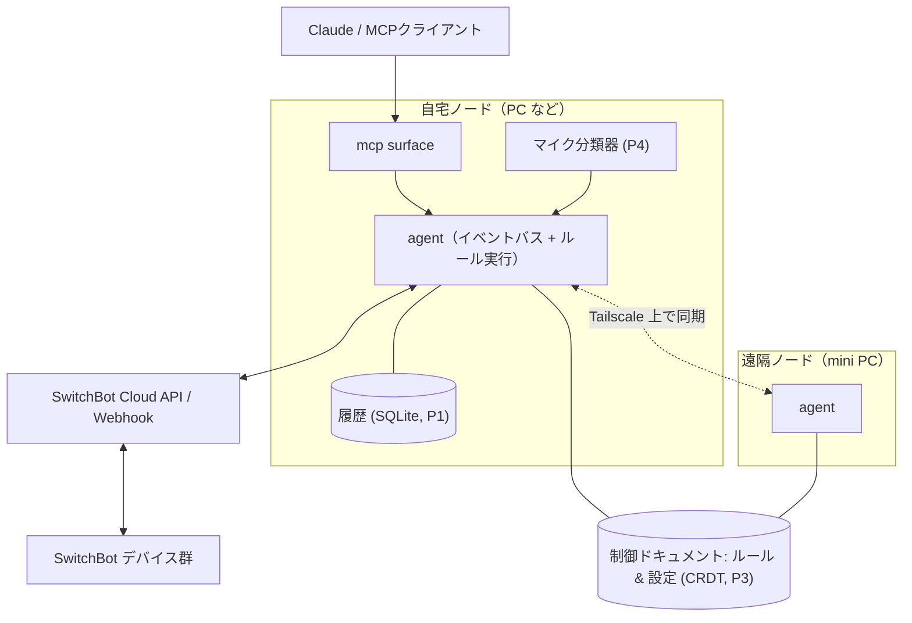

# tsukumo 設計書

- 状態: v0.1 ドラフト（壁打ちの成果物。すべて変更してよい）
- 日付: 2026-07-05

## 1. 背景

出発点は「IoT の面白いアプリケーション・ミドルウェアを作りたい」という壁打ち。制約と資産を整理した結果：

- はんだ付けやセンサー調達に時間は割けない（新規ハードウェア購入なしで始めたい）
- **SwitchBot 製品が家に大量にある**（＝クラウド API で今日から読み書きできるセンサーとアクチュエータ群）
- 遠隔地に mini PC が 1 台あり、SSH リバースプロキシで管理している（＝「たまに切断される遠隔ノード」という本物の題材）
- CRDT に興味がある。一方で数百台規模のフリート管理には興味がない

これらが 1 つのプロジェクトに合流する。それが tsukumo。

## 2. コンセプト

**tsukumo（付喪神）** — 長く使われた道具には魂が宿る、という日本の民間信仰から。家の道具（デバイス）に LLM という魂を宿す基盤、の意。

1. **読める** — 家の状態・履歴を Claude が文脈として持てる（MCP）
2. **書ける** — 家電・カーテン・プラグを LLM や自作コードから操作できる
3. **任せられる** — 日本語のルールをコンパイル時だけ LLM で決定的なルールに変換し、ローカルで回し続ける

## 3. 設計原則

1. **ローカルファースト** — ネットは切れるものとして設計する。切断中も定常運転は止まらず、復帰したら勝手に追いつく。遠隔ノードを特別扱いしない（自宅ノードと対等）。
2. **実行時 LLM レス** — LLM の仕事はコンパイル時（ルール生成・検証・説明）と対話時（MCP 経由の質問応答）だけ。24 時間の定常運転は決定的なコードのみ。速い・タダ・オフライン OK・再現可能。
3. **生データは家から出さない** — 音声などの生データはエッジでイベント化してから使う。外に出るのは「洗濯機が終わった」という事実だけ。
4. **1 ノードでも成立、N ノードで嬉しい** — 最初は自宅 1 台で完結する。ノードを足すと同期がついてくる。フリート管理（数百台〜）は非目標。
5. **依存は最小限** — Phase 0 は依存ゼロ（Node 標準ライブラリのみ）。依存を足すときは、足す理由をこのドキュメントに書く。

## 4. 全体アーキテクチャ



### コンポーネント

- **agent** — 各ノードに常駐するデーモン。イベント収集 → ルール評価 → アクション実行。
- **connector** — イベント源・アクション先との接続層。第 1 弾は SwitchBot（cloud API + Webhook）。将来はマイク分類器・天気・カレンダー・通知（Slack 等）。
- **kotodama（言霊）** — ルールコンパイラ。日本語 → ルール IR。コンパイル時に、曖昧な点の聞き返し・既存ルールとの矛盾検出・「なぜ/いつ発火するか」の説明文生成まで行う。
- **ルール IR** — trigger / condition / action からなる小さな JSON。決定的・dry-run 可能・差分レビュー可能。
- **sync** — ルールと設定を CRDT ドキュメント（Automerge 予定）としてノード間同期。トランスポートは Tailscale 上の TCP/WebSocket。NAT 越えと鍵管理は自作しない。
- **mcp** — Claude などの MCP クライアントへ家を公開する層。Phase 0 は SwitchBot 直結の単体サーバー、将来は agent の状態ストアを公開する形に統合する。

## 5. ルール IR の想像図（Phase 2 で確定）

```json
{
  "id": "rule-washer-notify",
  "source": "洗濯機が終わったら通知して。ただし私が家にいるときは通知しないで",
  "trigger": {
    "event": "switchbot.plug.washer.power",
    "transition": { "from": "on", "to": "off", "minOnMinutes": 10 }
  },
  "condition": { "not": { "state": "presence.home", "equals": true } },
  "action": { "notify": { "channel": "slack", "message": "洗濯終わったよ" } }
}
```

trigger / condition の語彙は connector が公開する**イベントカタログ**からしか選べない。コンパイラ（LLM）はカタログ外の語を使えない＝幻覚したルールはコンパイルエラーになる。表現できない要求には「表現できない」と正直に断らせる。

## 6. フェーズ計画

| Phase | 内容 | 完成の定義（デモできること） |
| --- | --- | --- |
| **0** | switchbot-mcp（済） | Claude に「寝室いま何度？」と聞くと実測値が返る。「プラグ切って」で切れる |
| **1** | agent デーモン + イベント収集 | SwitchBot の状態変化（Webhook + ポーリング）が SQLite に溜まり、「先週湿度が 60% を超えた時間帯は？」に MCP 経由で答えられる |
| **2** | kotodama v0 | 日本語ルール 1 本がコンパイル → ローカル発火。LLM はコンパイル時のみ。矛盾検出のデモ |
| **3** | CRDT 同期 + 遠隔ノード | 遠隔 mini PC が 2 号ノードに。オフライン中に両側でルールを編集 → 復帰時に矛盾なくマージ |
| **4** | マイクイベント源 | 生活音イベント（洗濯機終了・インターホン等）がトリガーに加わる。音声データは家から出ない |

## 7. 技術選定（v0.1 時点の決定・変更歓迎）

| 項目 | 決定 | 理由 |
| --- | --- | --- |
| 言語 | TypeScript を Node 22.18+ の type stripping で直接実行（ビルドレス） | 全ノードがフル PC なのでシングルバイナリの旨味よりイテレーション速度。MCP / Automerge / Anthropic SDK の生態系が一級。`git clone` だけで mini PC に配れる |
| 依存 | Phase 0 はゼロ | 供給網リスクなし・可搬性最大。P2 で Anthropic SDK、P3 で Automerge を追加予定 |
| ストレージ | SQLite（P1。まず `node:sqlite`、不足なら better-sqlite3） | 単一ファイル・バックアップ容易・依存最小 |
| ノード間ネットワーク | Tailscale 前提 | NAT 越え・鍵管理・死活の可視化を自作しない。自作するのはその上のレイヤー |
| CRDT | Automerge（P3） | ドキュメント指向でルール集合の表現に合う。学びたい技術でもある |
| テスト | `node --test`（組み込みランナー） | 依存ゼロ維持 |

## 8. 非目標

- 数百〜数千台規模のフリート管理、SaaS 化
- Home Assistant の置き換え（隣に立つ。将来 connector として繋ぐ選択肢はある）
- スマートホーム標準（Matter 等）の網羅

## 9. リスクと逃げ道

| リスク | 逃げ道 |
| --- | --- |
| SwitchBot cloud API への依存（レート制限 目安 1 万 req/日、クラウド障害時に操作不能） | Webhook 優先でポーリングを間引く・状態キャッシュ。温湿度計など一部デバイスは BLE ローカル読みへ移行可能 |
| Automerge の学習コスト・重さ | P3 まで遅延。それまでルール配布は「ただの JSON ファイル」。同期層は差し替え可能なインターフェースにしておく |
| 実行時 LLM レスゆえの表現力不足 | コンパイラが「表現できない」と断る設計を正とする。語彙はイベントカタログの成長で広げる |
| Node 22.18+ 前提（type stripping） | 全ノード自前管理なので Node のバージョンは揃えられる。困ったら tsc ビルドに切り替えるだけ |

## 10. 決定ログ

- **2026-07-05** — プロジェクト名を tsukumo（仮）に。Phase 0 を「依存ゼロの単体 SwitchBot MCP サーバー」として切り出し、MCP stdio プロトコルは自前実装（学習目的 + 依存ゼロ維持）。
