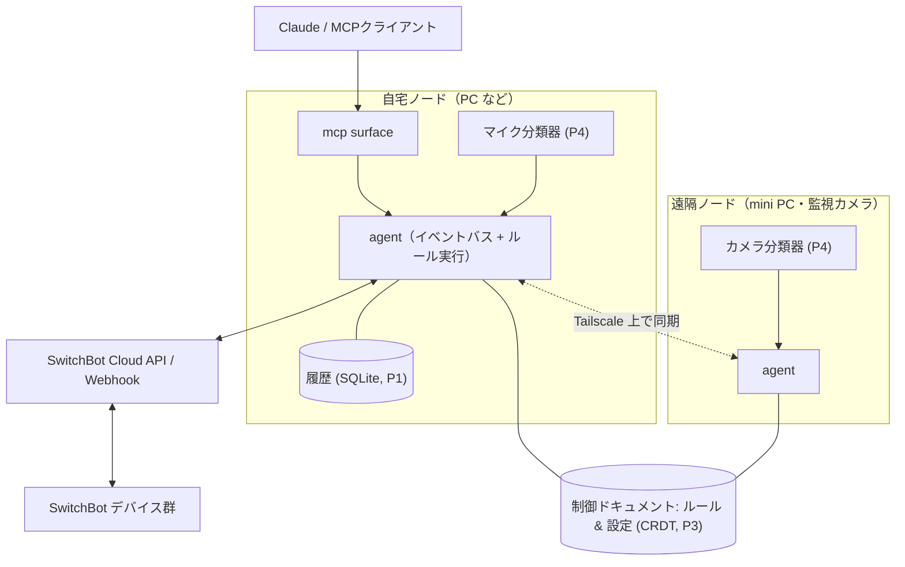

# tsukumo 設計書

- 状態: v0.1 ドラフト（壁打ちの成果物。すべて変更してよい）
- 日付: 2026-07-05

## 1. 背景

出発点は「IoT の面白いアプリケーション・ミドルウェアを作りたい」という壁打ち。制約と資産を整理した結果：

- はんだ付けやセンサー調達に時間は割けない（新規ハードウェア購入なしで始めたい）
- **SwitchBot 製品が家に大量にある**（＝クラウド API で今日から読み書きできるセンサーとアクチュエータ群）
- 遠隔地に mini PC が 1 台あり、SSH リバースプロキシで管理している（＝「たまに切断される遠隔ノード」という本物の題材）。USB カメラを繋いだ監視カメラとして運用する
- CRDT に興味がある。一方で数百台規模のフリート管理には興味がない

これらが 1 つのプロジェクトに合流する。それが tsukumo。

## 2. コンセプト

**tsukumo（付喪神）** — 長く使われた道具には魂が宿る、という日本の民間信仰から。家の道具（デバイス）に LLM という魂を宿す基盤、の意。

1. **読める** — 家の状態・履歴を Claude が文脈として持てる（MCP）
2. **書ける** — 家電・カーテン・プラグを LLM や自作コードから操作できる
3. **任せられる** — 日本語のルールをコンパイル時だけ LLM で決定的なルールに変換し、ローカルで回し続ける

## 3. 設計原則

1. **ローカルファースト** — ネットは切れるものとして設計する。切断中も定常運転は止まらず、復帰したら勝手に追いつく。遠隔ノードを特別扱いしない（自宅ノードと対等）。
2. **実行時 LLM レス** — LLM の仕事はコンパイル時（ルール生成・検証・説明）と対話時（MCP 経由の質問応答）だけ。24 時間の定常運転は決定的なコードのみ。速い・タダ・オフライン OK・再現可能。
3. **生データは家から出さない** — 音声・映像などの生データはエッジでイベント化してから使う。外に出るのは「洗濯機が終わった」「玄関で動きがあった」という事実だけ（映像スナップショットは明示的に要求されたときのみ取得）。
4. **1 ノードでも成立、N ノードで嬉しい** — 最初は自宅 1 台で完結する。ノードを足すと同期がついてくる。フリート管理（数百台〜）は非目標。
5. **依存は最小限** — Phase 0 は依存ゼロ（Node 標準ライブラリのみ）。依存を足すときは、足す理由をこのドキュメントに書く。

## 4. 全体アーキテクチャ



### コンポーネント

- **agent** — 各ノードに常駐するデーモン。イベント収集 → ルール評価 → アクション実行。
- **connector** — イベント源・アクション先との接続層。第 1 弾は SwitchBot（cloud API + Webhook）。将来はマイク分類器・USB カメラ（遠隔ノードの監視カメラ。動体・人物検知をエッジでイベント化し、映像そのものは要求時のみ）・天気・カレンダー・通知（Slack 等）。
- **kotodama（言霊）** — ルールコンパイラ。日本語 → ルール IR。コンパイル時に、曖昧な点の聞き返し・既存ルールとの矛盾検出・「なぜ/いつ発火するか」の説明文生成まで行う。
- **ルール IR** — trigger / condition / action からなる小さな JSON。決定的・dry-run 可能・差分レビュー可能。
- **sync** — ルールと設定を CRDT ドキュメント（Automerge 予定）としてノード間同期。トランスポートは Tailscale 上の TCP/WebSocket。NAT 越えと鍵管理は自作しない。
- **mcp** — Claude などの MCP クライアントへ家を公開する層。Phase 0 は SwitchBot 直結の単体サーバー、将来は agent の状態ストアを公開する形に統合する。

## 5. ルール IR（v0 確定形）

```json
{
  "id": "humidity-fan-notify",
  "source": "湿度が60%を超えたらサーキュレーターをつけて通知して",
  "enabled": true,
  "trigger": {
    "deviceId": "C12345ABCDE",
    "field": "humidity",
    "to": { "gt": 60 },
    "from": { "lte": 60 }
  },
  "condition": { "time": { "after": "08:00", "before": "22:00" } },
  "actions": [
    { "type": "switchbot_command", "deviceId": "PLUG567890", "command": "turnOn" },
    { "type": "notify", "message": "湿度が60%を超えたよ" }
  ],
  "explanation": "日中に湿度が60%を上回った瞬間、サーキュレーターをつけて通知します。"
}
```

- trigger は「1デバイス1フィールドの変化」。`from`/`to` で挟むと「しきい値を越えた瞬間に1回」を表現できる
- condition は allOf / anyOf / not / device（他デバイスの最新観測値への述語）/ time（時間帯・日またぎ可）
- actions は switchbot_command / notify / log を上から順に実行（失敗は記録して続行）

trigger / condition の語彙は**イベントカタログ**（agent が実際に観測した deviceId / field）からしか選べない。コンパイラ（LLM）がカタログ外の語を幻覚したらバリデーションで弾かれ、エラーをフィードバックして1回だけリトライする。表現できない要求（定時実行、「N分続いたら」等）には「表現できない」と正直に断らせる。

## 6. フェーズ計画

| Phase | 内容 | 状態 | 完成の定義（デモできること） |
| --- | --- | --- | --- |
| **0** | switchbot-mcp | ✅ 実装済（実機検証待ち） | Claude に「寝室いま何度？」と聞くと実測値が返る。「プラグ切って」で切れる |
| **1** | agent デーモン + イベント収集 + 履歴クエリ | ✅ 実装済（実機検証待ち） | SwitchBot の状態変化（ポーリング + Webhook）が JSONL ストアに溜まり、「先週湿度が 60% を超えた時間帯は？」に MCP 経由で答えられる |
| **2** | kotodama v0 | ✅ 実装済（実機検証待ち） | 日本語ルールがコンパイル → agent がホットリロード → ローカル発火。LLM はコンパイル時のみ。カタログ外語彙は機械的に弾き、既存ルールとの重複は警告 |
| **3** | CRDT 同期 + 遠隔ノード | ✅ 実装済（要 `npm install` + 手元検証） | 遠隔 mini PC が 2 号ノードに。オフライン中に両側でルールを編集 → 復帰時に矛盾なくマージ。ルールの `node` フィールドで実行ノードを指定し多重発火を防ぐ |
| **4** | メディアイベント源（マイク・カメラ） | ⬜ | 自宅の生活音イベント（洗濯機終了・インターホン等）と、遠隔ノードの動体・人物検知イベントがトリガーに加わる。音声・映像の生データはノードの外に出ない。スナップショットは MCP 経由で明示要求時のみ（MCP の image content で返す） |

## 7. 技術選定（v0.1 時点の決定・変更歓迎）

| 項目 | 決定 | 理由 |
| --- | --- | --- |
| 言語 | TypeScript を Node 22.18+ の type stripping で直接実行（ビルドレス） | 全ノードがフル PC なのでシングルバイナリの旨味よりイテレーション速度。MCP / Automerge / Anthropic SDK の生態系が一級。`git clone` だけで mini PC に配れる |
| 依存 | **コア（agent / mcp / kotodama）はゼロを維持**。唯一の例外が `packages/sync` の Automerge | 供給網リスクなし・可搬性最大。sync は別プロセスなので、依存が壊れてもルール実行は止まらない |
| ストレージ | **JSONL 追記（日付分割）** ← P1 実装時に SQLite から変更 | `node:sqlite` は動作確認したが実験的機能で Node マイナーバージョン依存が残る。JSONL はどの Node でも動き、`tail -f` でイベントが見え、追記は雑に堅牢。読み書きは `JsonlEventStore` に隔離してあり、量が痛くなったら SQLite に差し替え可能 |
| コンパイル時 LLM | **Gemini API / Claude API 両対応**（プロバイダ抽象、環境変数のキーで自動選択、素の `fetch`） | SDK 依存を避ける。実行時には一切使わないので、プロバイダ選択は品質とコストだけの問題 |
| ノード間ネットワーク | Tailscale 前提 | NAT 越え・鍵管理・死活の可視化を自作しない。自作するのはその上のレイヤー |
| CRDT | **Automerge（採用済み）**。ルール1件は doc 内の不可分な JSON 文字列 | 比較検討は docs/crdt-choice.md。実績・履歴・同期プロトコルを買いつつ、ルール単位の粗粒度マージで「キメラルール」を防ぐ |
| テスト | `node --test`（組み込みランナー） | 依存ゼロ維持 |

## 8. 非目標

- 数百〜数千台規模のフリート管理、SaaS 化
- Home Assistant の置き換え（隣に立つ。将来 connector として繋ぐ選択肢はある）
- スマートホーム標準（Matter 等）の網羅

## 9. リスクと逃げ道

| リスク | 逃げ道 |
| --- | --- |
| SwitchBot cloud API への依存（レート制限 目安 1 万 req/日、クラウド障害時に操作不能） | Webhook 優先でポーリングを間引く・状態キャッシュ。温湿度計など一部デバイスは BLE ローカル読みへ移行可能 |
| Automerge の学習コスト・重さ | P3 まで遅延。それまでルール配布は「ただの JSON ファイル」。同期層は差し替え可能なインターフェースにしておく |
| 実行時 LLM レスゆえの表現力不足 | コンパイラが「表現できない」と断る設計を正とする。語彙はイベントカタログの成長で広げる |
| Node 22.18+ 前提（type stripping） | 全ノード自前管理なので Node のバージョンは揃えられる。困ったら tsc ビルドに切り替えるだけ |

## 10. 決定ログ

- **2026-07-05** — プロジェクト名を tsukumo（仮）に。Phase 0 を「依存ゼロの単体 SwitchBot MCP サーバー」として切り出し、MCP stdio プロトコルは自前実装（学習目的 + 依存ゼロ維持）。
- **2026-07-05** — 遠隔 mini PC の役割が確定：USB カメラでの監視カメラ運用。カメラは Phase 4 のイベント源（エッジで動体・人物検知）とし、映像の生データはノード外に出さない。「動体検知 → SwitchBot ライト点灯」のような遠隔×自宅をまたぐルールが Phase 3 以降の看板デモ候補。
- **2026-07-06** — Phase 1 + 2 を実装。ストレージは SQLite から **JSONL（日付分割・追記専用）** に変更（理由は §7）。共有部品を `packages/core` に集約し、`agent`（常駐・ポーリング・Webhook 受信・ルール実行）と `kotodama`（コンパイラ CLI）を追加。依存ゼロ方針を継続——Claude API も SDK ではなく素の `fetch` で叩く（コンパイル時のみ）。ルール IR v0 を §5 の形で確定。デバウンスや「N分継続」トリガーは v0 では見送り（`from`/`to` で挟む書き方で大半を回避できるため）。
- **2026-07-06** — kotodama を **Gemini API 対応**（ANTHROPIC_API_KEY が入手できないため）。`providers.ts` にプロバイダ抽象を追加し、Claude / Gemini を環境変数キーで自動選択。Gemini は JSON モード（`responseMimeType`）+ 思考トークン分の余裕を持った `maxOutputTokens` で呼ぶ。既定モデルは `gemini-2.5-flash`（`TSUKUMO_COMPILE_MODEL` で変更可）。コンパイラ本体はプロバイダ非依存になり、テストはスタブプロバイダで検証。
- **2026-07-07** — **Phase 3 を Automerge で実装**（比較検討と決定の経緯は docs/crdt-choice.md）。`packages/sync` として別プロセスに隔離し、コアの依存ゼロを守る。設計の要点: (1) ルール1件＝doc 内の不可分な JSON 文字列（同時編集はどちらかが丸ごと勝ち、負けた側は履歴に残る）、(2) ファイル⇄doc の突き合わせは lastApplied を基準にした 3-way（純粋ロジックとして `bridge.ts` に分離し、収束・静止をシミュレーションテストで保証）、(3) **削除は編集に勝つ**・**同時編集はローカル優先**、(4) ルール IR に `node` フィールドを追加し、実行ノードを指定して多重発火を防止（kotodama が `TSUKUMO_NODE` から自動刻印）。Automerge API は `service.ts` の約200行に隔離し、repo 1.x/2.x 両対応の防御的シムで書いた（この環境では npm 不可のため実行未検証。実物検証用の 2 ノード E2E テストを同梱し、未インストール環境では自動 skip）。
